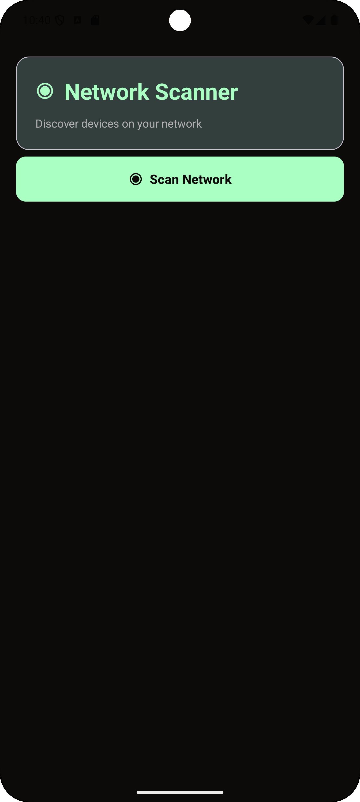
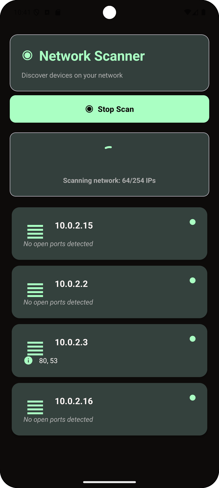
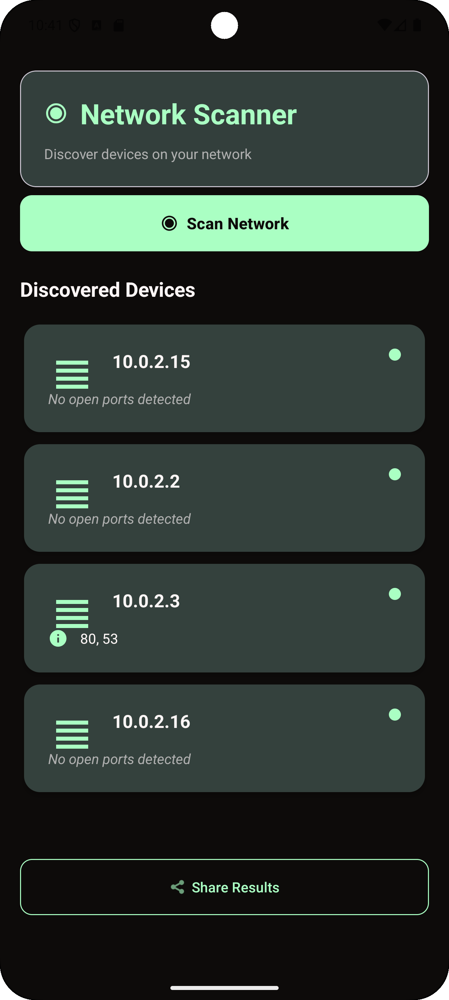
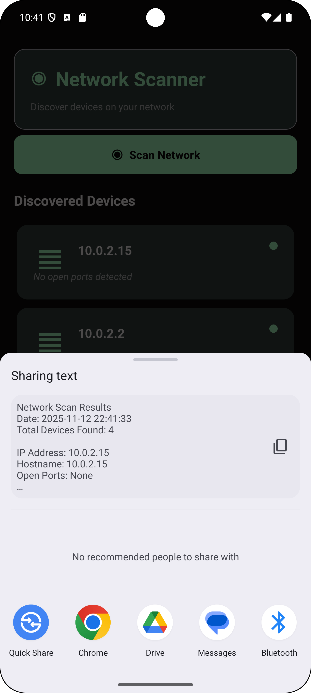

# Network Scanner

<div align="center">

![Network Scanner]

**A powerful Android application for scanning local networks, discovering active devices, and detecting open ports with a sleek dark theme interface.**

[](https://www.android.com/)
[](LICENSE)
[](https://www.java.com/)

</div>

---

## 📱 Overview

Network Scanner is a professional Android application that allows users to scan their local network for active devices and check for open ports. Built with Material Design 3, the app features a sophisticated dark theme with electric lime green accents, providing a high-tech, futuristic user experience.

### Key Features

- 🔍 **IP Network Scanning**: Automatically discovers all active devices on your local network
- 🔌 **Port Scanning**: Detects open ports on discovered devices (22, 23, 80, 443, 8080, 3389, and more)
- 📊 **Real-time Progress**: Live updates during network scanning with progress indicators
- 🎨 **Modern Dark UI**: Sleek dark theme with professional color scheme
- 📤 **Share Results**: Easily share scan results via any Android app
- ⚡ **Fast & Efficient**: Concurrent scanning using thread pools for optimal performance
- 📱 **Material Design 3**: Built with the latest Material Design components

---

## 🎨 Screenshots

<div align="center">

| Main Screen | Scanning | Results | Device Details |
|:-----------:|:--------:|:-------:|:-------------:|
|  |  |  |  |

</div>

---

## 🚀 Features in Detail

### Network Discovery
- Automatically detects your local network IP address
- Scans the entire subnet (1-254 IP addresses)
- Uses efficient concurrent scanning with thread pools
- Real-time device discovery with progress tracking

### Port Detection
- Scans common ports: 22, 23, 80, 443, 8080, 3389, 21, 25, 53, 110, 143, 993, 995
- Parallel port scanning for fast results
- Visual indicators for devices with open ports
- Detailed port information display

### User Interface
- **Dark Theme**: Deep charcoal background (#0D0B0A) with navy blue surfaces (#2A3132)
- **Accent Colors**: Electric lime green (#AAFFC3) for CTAs and highlights
- **Typography**: Soft white/off-white text for excellent readability
- **Material Design 3**: Modern card-based layout with smooth animations

---

## 📋 Requirements

- **Android Version**: 8.0 (API 26) or higher
- **Permissions**:
  - `INTERNET` - Required for network scanning
  - `ACCESS_NETWORK_STATE` - To check network connectivity
  - `ACCESS_WIFI_STATE` - To detect WiFi network information

---

## 🛠️ Installation

### Building from Source

1. **Clone the repository**
   ```bash
   git clone https://github.com/om-kumar-singh/Network-Scanner.git
   cd Network-Scanner
   ```

2. **Open in Android Studio**
   - Open Android Studio
   - Select "Open an Existing Project"
   - Navigate to the cloned repository folder

3. **Sync Gradle**
   - Android Studio will automatically sync Gradle dependencies
   - Wait for the sync to complete

4. **Build the APK**
   - Go to `Build` → `Build Bundle(s) / APK(s)` → `Build APK(s)`
   - The APK will be generated in `app/build/outputs/apk/debug/`

5. **Install on Device**
   - Transfer the APK to your Android device
   - Enable "Install from Unknown Sources" in device settings
   - Install the APK

### Using Pre-built APK

Download the latest release APK from the [Releases](https://github.com/om-kumar-singh/Network-Scanner/releases) section and install it on your Android device.

---

## 💻 Usage

1. **Launch the App**
   - Open Network Scanner from your app drawer

2. **Start Scanning**
   - Tap the "Scan Network" button
   - The app will automatically detect your local network and begin scanning

3. **View Results**
   - Discovered devices will appear in real-time
   - Each device card shows:
     - IP Address
     - Hostname (if available)
     - Open ports (if any)
     - Online status indicator

4. **Share Results**
   - Tap "Share Results" to share scan results via any app
   - Results are formatted as text for easy sharing

---

## 🏗️ Project Structure

```
Network-Scanner/
├── app/
│   ├── src/
│   │   └── main/
│   │       ├── java/com/example/networkscannerv1/
│   │       │   ├── MainActivity.java          # Main activity with UI logic
│   │       │   ├── NetworkScanner.java        # IP network scanning logic
│   │       │   ├── PortScanner.java           # Port scanning functionality
│   │       │   ├── DeviceInfo.java            # Device data model
│   │       │   └── DeviceAdapter.java         # RecyclerView adapter
│   │       ├── res/
│   │       │   ├── layout/                    # XML layouts
│   │       │   ├── values/                    # Colors, strings, themes
│   │       │   └── drawable/                  # Icons and graphics
│   │       └── AndroidManifest.xml
│   └── build.gradle.kts
├── screenshots/                                # App screenshots
├── README.md
└── LICENSE
```

---

## 🧩 Technical Details

### Architecture
- **Language**: Java
- **UI Framework**: Android XML Layouts
- **Design System**: Material Design 3
- **Minimum SDK**: 26 (Android 8.0)
- **Target SDK**: 34 (Android 14)
- **Gradle Plugin**: 8.5.2

### Key Components

#### NetworkScanner.java
- Handles IP address detection
- Performs concurrent network scanning using `ExecutorService`
- Uses `InetAddress.isReachable()` for device discovery
- Provides callbacks for real-time updates

#### PortScanner.java
- Scans common ports on discovered devices
- Uses `Socket` connections with timeouts
- Parallel port scanning for performance
- Returns list of open ports per device

#### MainActivity.java
- Manages UI components and user interactions
- Handles scan lifecycle (start/stop)
- Implements share functionality
- Updates UI on background thread results

### Dependencies
- `androidx.appcompat:appcompat:1.7.1`
- `com.google.android.material:material:1.13.0`
- `androidx.activity:activity:1.8.2`
- `androidx.constraintlayout:constraintlayout:2.2.1`
- `androidx.cardview:cardview:1.0.0`

---

## 🎨 Design Philosophy

The app features a **dark theme** designed to exude sophistication and high technology:

- **Primary Background**: Deep Charcoal/Black (#0D0B0A, #2A3132)
- **Primary Text**: Soft White/Off-White (#FDF6F6, #E7E8D1)
- **Secondary Accent**: Electric Lime Green (#AAFFC3) for CTAs and highlights
- **Neutral Text**: Light Gray (#B0B0B0) for secondary information

This color scheme creates a professional, high-energy tech brand aesthetic perfect for network scanning applications.

---

## 🤝 Contributing

Contributions are welcome! Please feel free to submit a Pull Request. For major changes, please open an issue first to discuss what you would like to change.

1. Fork the repository
2. Create your feature branch (`git checkout -b feature/AmazingFeature`)
3. Commit your changes (`git commit -m 'Add some AmazingFeature'`)
4. Push to the branch (`git push origin feature/AmazingFeature`)
5. Open a Pull Request

---

## 📝 License

This project is licensed under the MIT License - see the [LICENSE](LICENSE) file for details.

---

## 👤 Author

**Om Kumar Singh**

- GitHub: [@om-kumar-singh](https://github.com/om-kumar-singh)
- LinkedIn: [Om Kumar Singh](https://www.linkedin.com/in/om-kumarsingh)
- Email: omkumarsingh2004@gmail.com

---

## 🙏 Acknowledgments

- Material Design 3 components by Google
- Android development community
- All contributors and users of this project

---

## 📄 Copyright

Copyright (c) 2025 [Om Kumar Singh](https://github.com/om-kumar-singh)

All rights reserved.

---

<div align="center">

**Made with ❤️ by [Om Kumar Singh](https://github.com/om-kumar-singh)**

⭐ Star this repo if you find it helpful!

</div>

